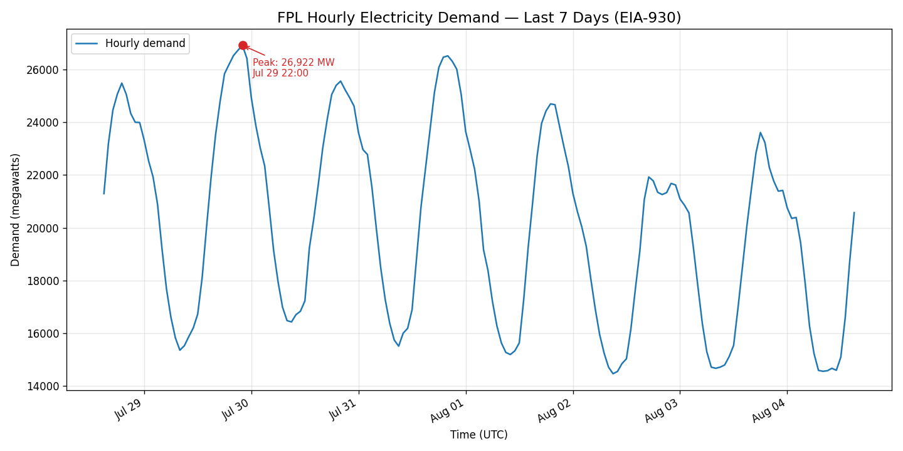

# power-demand-report

> Automated electricity demand reports from the EIA API — CSV, chart, and summary.

## What it does

`power-demand-report` fetches a week of **hourly grid demand** from the U.S. Energy
Information Administration's [EIA-930 dataset](https://www.eia.gov/electricity/gridmonitor/)
for any US balancing authority and turns it into a shareable report:

- a clean **CSV** of timestamp + megawatt readings,
- an **annotated line chart** with the weekly peak marked, and
- a **console summary** (peak, low, daily average, weekly total).

The default region is **FPL (Florida Power & Light)** — changeable to any EIA
respondent code in one line (`RESPONDENT` at the top of `power_report.py`).

## Sample output



```
============================================================
  FPL ELECTRICITY DEMAND — LAST 7 DAYS (EIA-930)
============================================================
  Coverage        : 2026-07-28 15:00 -> 2026-08-04 15:00 UTC (169 hourly readings)
  Peak demand     : 26,922 MW  at 2026-07-29 22:00 UTC
  Lowest demand   : 14,467 MW  at 2026-08-02 09:00 UTC
  Daily average   : 20,327 MW
  Total for week  : 3,404,152 MWh
============================================================
```

## Setup

1. **Get a free EIA API key** (emailed instantly):
   https://www.eia.gov/opendata/register.php

2. **Copy the example config and paste your key in:**

   ```bash
   cp config.example.py config.py
   ```

   Then edit `config.py` so it reads:

   ```python
   EIA_API_KEY = "your-real-key"
   ```

   `config.py` is **git-ignored**, so your key never gets committed.

## How to run

```bash
pip install -r requirements.txt
python3 power_report.py
```

Outputs are written to `./output/` (`demand.csv` and `demand_chart.png`), and the
summary is printed to the console.

## Features

- **Single file** — everything lives in `power_report.py`.
- **Defensive API error handling** — network failures, HTTP errors, and empty or
  malformed responses print a clear message instead of crashing.
- **Secrets kept out of version control** — the API key lives only in the
  git-ignored `config.py`.
- **Works for any EIA respondent code** — point it at CISO, ERCO, PJM, or any
  other EIA-930 balancing authority by changing one line.
